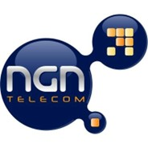

# 👋 Jardel Costa - Support Engineer 🚀

<table>
  <tr>
    <td></td>
    <td></td>
    <td></td>
    <td> & </td>
    <td></td>
    <td></td>
    <td></td>
  </tr>
</table>

💻 With over 20 years of experience connecting technology solutions and clients. Expert in technical support, presentations, and project management. Experienced in diverse areas, from development to client service. Focused on results and client satisfaction.

## Experience:

* **[NGN Telecom], [São Paulo, BR]** | [Nov/2004] - [to present]
    * 📈 Flexibility and adaptability in supporting different solutions in the markets the company operates in. 🚀 Collaborating and actively participating in successful projects and integrations. 🧑‍🏫 Providing technical training sessions with excellence.

## Skills:

* **Technologies:** Python, Java, SQL, Docker, AWS, Azure, etc.
* **Soft Skills:** Communication, Problem Solving, Teamwork, etc.

## Projects:

* [GitHub Link] - Project Summary - focus on results and technology.
* [GitHub Link (optional)] - Project Summary

## Contact:

* [LinkedIn] 💼 https://www.linkedin.com/in/jardelcosta1609
* [GitHub] 💻 https://github.com/jardel-costa
* [NGN] 👨‍💻 https://www.ngntelecom.com.br

## Mission:

🤝 To deliver innovative, customized solutions to ensure client satisfaction.

## Looking forward to collaborating and actively participating in new opportunities in NGN Telecom projects and integrations! 🚀